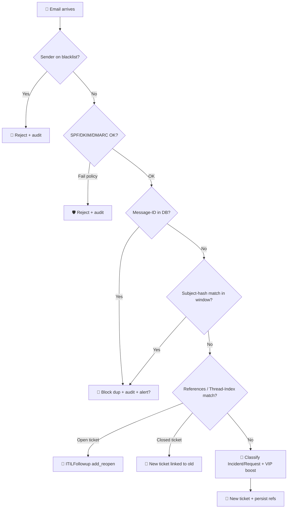

# 📧 Mail Analyzer — GLPI Plugin

<p align="center">
  
</p>

<p align="center">
  <a href="#-english">English</a> •
  <a href="#-русский">Русский</a> •
  <a href="#-português">Português</a>
</p>

<p align="center">
  
  
  
  
</p>

---

<h2 id="-english">🇬🇧 English</h2>

**Intelligent email conversation tracking + ITIL routing for GLPI 11**

Combines related emails into one ticket, blocks duplicates, classifies Incident vs Service Request, escalates VIP senders, validates SPF/DKIM/DMARC, deduplicates attachments, and ships a complete audit log with CSV export.

### ✨ Features

| Feature                          | Description                                                                                                                        |
| -------------------------------- | ---------------------------------------------------------------------------------------------------------------------------------- |
| 🔁 **Duplicate detection**       | Blocks duplicate tickets by `Message-ID` and (fallback) by SHA-1 of normalised subject within a configurable window                |
| 💬 **Auto follow-up**            | Replies to open tickets become `ITILFollowup` entries with `add_reopen=1`                                                          |
| 🔗 **Ticket linking**            | Replies to closed tickets create a new ticket linked to the original                                                               |
| 🧵 **Thread-Index**              | Microsoft Exchange `Thread-Index` header parsing for richer conversation matching                                                  |
| 🎯 **Smart ITIL classification** | Detects Incident vs Service Request from configurable keyword dictionaries; applied to `Ticket::$input` before business rules fire |
| ⭐ **VIP escalation**             | Listed senders / domains get maximum urgency and bypass subject-hash dedup                                                         |
| 🛡️ **SPF / DKIM / DMARC**       | Reads RFC 8601 `Authentication-Results` set by the upstream MTA and rejects failed messages (policy is per-check)                  |
| 📎 **Attachment dedup**          | Skips identical attachments on the same ticket by SHA-256 — saves storage on long signature-heavy threads                          |
| 🚦 **Domain filters**            | Whitelist / blacklist / VIP lists, one entry per line, full address or `@domain`                                                   |
| 🔔 **Smart alerts**              | Native GLPI `NotificationEvent` raised when N duplicates are blocked within a window (both configurable)                           |
| 📊 **Dashboard**                 | Twig-rendered statistics with period filter, recent activity, decision reasoning                                                   |
| 📋 **Full audit log**            | Every decision stored with `from_email`, `subject`, `subject_hash`, `decision_reason` — searchable via GLPI Search Engine          |
| 📤 **CSV export**                | UTF-8 + BOM (Excel-friendly), respects the dashboard period filter                                                                 |
| ⏱️ **Auto cleanup**              | Native GLPI CronTask trims orphans and old stats daily                                                                             |
| 🛠️ **CLI cleanup**              | `php bin/console plugins:mailanalyzer:cleanup` with `--dry-run`, `--stats-days=N`                                                          |
| 🌍 **i18n**                      | `en_GB`, `ru_RU`, `pt_BR` shipped                                                                                                  |

### 📋 Requirements

| Requirement | Version                    |
| ----------- | -------------------------- |
| GLPI        | `>= 11.0.0` and `< 11.1`   |
| PHP         | `>= 8.2`                   |
| Database    | MySQL 8.0+ / MariaDB 10.5+ |

### 🚀 Installation

1. Extract the `mailanalyzer` folder into `<glpi>/plugins/`
2. Navigate to **Setup → Plugins** in GLPI
3. Click **Install** then **Enable**

### ⚙️ Configuration

Go to **Setup → General → Mail Analyzer**. All options live in the `plugin:mailanalyzer` config context and are validated server-side.

#### Sections

- **Thread tracking** — toggle Microsoft Exchange `Thread-Index`
- **Domain filters** — whitelist / blacklist / VIP
- **Smart classification (ITIL)** — keyword dictionaries for Incident, Service Request, high-urgency, plus default type
- **Smart duplicate detection** — enable subject-hash fallback dedup + window
- **Sender authentication** — SPF / DKIM / DMARC policies (per-check reject toggle)
- **Attachment deduplication** — SHA-256 dedup on per-ticket attachments
- **Alerts** — threshold + window for the duplicate-storm `NotificationEvent`

### 🔧 How it works



### 🖥️ CLI Commands

```bash
# Purge orphan message_id rows + show summary
php bin/console plugins:mailanalyzer:cleanup

# Also trim stats older than 90 days
php bin/console plugins:mailanalyzer:cleanup --stats-days=90

# Preview only — no changes
php bin/console plugins:mailanalyzer:cleanup --dry-run
```

### 📁 File structure

```
mailanalyzer/
├── front/
│   ├── config.form.php           # → Setup → Config tab redirect
│   ├── stats.php                 # Period filter POST endpoint
│   ├── export.php                # CSV export endpoint
│   ├── auditlog.php              # GLPI Search view (audit log)
│   └── messageid.php             # GLPI Search view (message-id table)
├── inc/
│   ├── core.class.php            # Thin orchestrator (hooks → services)
│   ├── installer.class.php       # DB schema (clean GLPI 11)
│   ├── domainfilter.class.php    # Whitelist / blacklist / VIP
│   ├── threadresolver.class.php  # Message-ID / Thread-Index / References / subject-hash
│   ├── classifier.class.php      # ITIL: Incident vs Service Request, urgency keywords
│   ├── authvalidator.class.php   # SPF / DKIM / DMARC verdict from Authentication-Results
│   ├── attachmentdedup.class.php # SHA-256 attachment dedup (Document_Item hook)
│   ├── auditlog.class.php        # Append-only audit log
│   ├── notificationdispatcher.class.php  # Duplicate-storm alerts
│   ├── exporter.class.php        # CSV streaming exporter
│   ├── mailcollector.class.php   # IMAP/POP wrapper (Thread-Index, deleteMails)
│   ├── stats.class.php           # Dashboard + Search options
│   ├── messageid.class.php       # Search options for message_id table
│   ├── config.class.php          # Settings tab
│   ├── crontask.class.php        # Native CronTask for housekeeping
│   └── cleanupcommand.class.php  # bin/console plugins:mailanalyzer:cleanup
├── templates/                    # Twig (Bootstrap 5)
│   ├── config.html.twig
│   ├── dashboard.html.twig
│   └── healthcheck.html.twig
├── locales/
│   ├── en_GB.po / .mo
│   ├── ru_RU.po / .mo
│   ├── pt_BR.po / .mo
│   └── _compile_mo.py            # Helper for compiling PO → MO without msgfmt
├── hook.php                      # Install/uninstall (thin: → Installer)
├── setup.php                     # Plugin metadata + hook registration
├── mailanalyzer.xml              # Plugin catalogue metadata
└── logo.png
```

### 🗄️ Database tables

| Table                                  | Purpose                                                                                                                 |
| -------------------------------------- | ----------------------------------------------------------------------------------------------------------------------- |
| `glpi_plugin_mailanalyzer_message_id`  | `(message_id, mailcollectors_id) → tickets_id` plus `subject_hash`, `date_created` for fallback dedup                   |
| `glpi_plugin_mailanalyzer_stats`       | Full audit log: `action_type`, `tickets_id`, `from_email`, `subject`, `subject_hash`, `decision_reason`, `date_created` |
| `glpi_plugin_mailanalyzer_attachments` | `(tickets_id, sha256) → documents_id` for attachment dedup                                                              |

---

<h2 id="-русский">🇷🇺 Русский</h2>

**Умный анализ почтовых цепочек + ITIL-маршрутизация для GLPI 11**

Объединяет связанные письма в одну заявку, блокирует дубликаты, классифицирует Инцидент vs Запрос на обслуживание, эскалирует VIP-отправителей, проверяет SPF/DKIM/DMARC, дедуплицирует вложения. Полный аудит-лог и экспорт в CSV в комплекте.

### ✨ Возможности

| Функция                       | Описание                                                                                               |
| ----------------------------- | ------------------------------------------------------------------------------------------------------ |
| 🔁 **Обнаружение дубликатов** | По `Message-ID` и резервно по SHA-1 нормализованной темы в настраиваемом окне                          |
| 💬 **Авто-комментарии**       | Ответы на открытые заявки добавляются как `ITILFollowup` с `add_reopen=1`                              |
| 🔗 **Связанные заявки**       | Ответы на закрытые заявки создают новую заявку, связанную с исходной                                   |
| 🧵 **Thread-Index**           | Разбор заголовка `Thread-Index` Microsoft Exchange для точного отслеживания цепочек                    |
| 🎯 **ITIL-классификация**     | Определение типа (Инцидент / Запрос на обслуживание) по словарям ключевых слов                         |
| ⭐ **VIP-эскалация**           | Отправители/домены в списке VIP получают максимальную срочность                                        |
| 🛡️ **SPF / DKIM / DMARC**    | Читает `Authentication-Results` от вышестоящего MTA, политика отказа настраивается по каждой проверке  |
| 📎 **Дедуп вложений**         | Пропускает одинаковые вложения в одной заявке по SHA-256                                               |
| 🚦 **Фильтры доменов**        | Whitelist / Blacklist / VIP — по одной записи в строке, полный адрес или `@домен`                      |
| 🔔 **Умные алерты**           | Нативный GLPI `NotificationEvent` при «шторме дубликатов» (порог + окно настраиваются)                 |
| 📊 **Дашборд**                | Twig + Bootstrap 5: статистика, недавняя активность, обоснования решений                               |
| 📋 **Полный аудит-лог**       | Каждое решение с `from_email`, `subject`, `subject_hash`, `decision_reason` — ищется через GLPI Search |
| 📤 **Экспорт CSV**            | UTF-8 + BOM (открывается в Excel без проблем), фильтр по периоду                                       |
| ⏱️ **Авточистка**             | Нативный GLPI CronTask убирает осиротевшие записи и старую статистику                                  |
| 🛠️ **CLI-очистка**           | `php bin/console plugins:mailanalyzer:cleanup` с `--dry-run`, `--stats-days=N`                                 |
| 🌍 **i18n**                   | В комплекте `ru_RU`, `en_GB`, `pt_BR`                                                                  |

### 📋 Требования

| Требование | Версия                     |
| ---------- | -------------------------- |
| GLPI       | `>= 11.0.0` и `< 11.1`     |
| PHP        | `>= 8.2`                   |
| СУБД       | MySQL 8.0+ / MariaDB 10.5+ |

### 🚀 Установка

1. Распаковать папку `mailanalyzer` в `<glpi>/plugins/`
2. В GLPI: **Настройка → Плагины**
3. Нажать **Установить**, затем **Включить**

### ⚙️ Конфигурация

**Настройка → Общие → Mail Analyzer**. Все параметры хранятся в контексте `plugin:mailanalyzer`.

#### Разделы настроек

- **Отслеживание цепочек** — переключатель Thread-Index
- **Фильтры доменов** — whitelist / blacklist / VIP
- **Умная классификация (ITIL)** — словари ключевых слов для Инцидента, Запроса на обслуживание, высокой срочности; тип по умолчанию
- **Умное обнаружение дубликатов** — резервный дедуп по хэшу темы + окно
- **Аутентификация отправителя** — SPF / DKIM / DMARC: отдельный переключатель отказа по каждой проверке
- **Дедупликация вложений** — SHA-256-дедуп вложений в пределах заявки
- **Уведомления** — порог и окно для шторма дубликатов

### 🔍 Поиск по таблицам плагина

В меню **Plugins → Mail Analyzer** доступны два экрана нативного GLPI Search:

- **Audit log** — фильтрация по действию, отправителю, теме, периоду
- **Message-IDs** — поиск по конкретному Message-ID, привязке к заявке

### 🖥️ CLI-команды

```bash
# Очистка осиротевших записей + сводка
php bin/console plugins:mailanalyzer:cleanup

# Дополнительно подрезать статистику старше 90 дней
php bin/console plugins:mailanalyzer:cleanup --stats-days=90

# Только просмотр — без изменений
php bin/console plugins:mailanalyzer:cleanup --dry-run
```

### 🌐 Перевод

`.po`-файлы — в `locales/`. Чтобы пересобрать `.mo` без установленного `msgfmt`:

```powershell
python locales/_compile_mo.py locales/ru_RU.po locales/ru_RU.mo
```

---

<h2 id="-português">🇧🇷 Português</h2>

**Análise inteligente de conversas por e-mail + roteamento ITIL para GLPI 11**

Combina e-mails relacionados em um único chamado, evita duplicatas, classifica Incidente vs Requisição de Serviço, escalona remetentes VIP, valida SPF/DKIM/DMARC e deduplicate anexos.

### ✨ Funcionalidades

| Funcionalidade                   | Descrição                                                                       |
| -------------------------------- | ------------------------------------------------------------------------------- |
| 🔁 **Detecção de Duplicatas**    | Bloqueia chamados duplicados pelo `Message-ID` e (fallback) por hash da assunto |
| 💬 **Acompanhamento Automático** | Respostas a chamados existentes viram acompanhamentos                           |
| 🔗 **Vinculação de Chamados**    | Resposta a um chamado fechado cria novo chamado vinculado                       |
| 🧵 **Suporte a Thread-Index**    | Análise do cabeçalho `Thread-Index` do Microsoft Exchange                       |
| 🎯 **Classificação ITIL**        | Detecta Incidente vs Requisição por palavras-chave                              |
| ⭐ **Escalada VIP**               | Remetentes/domínios VIP recebem urgência máxima                                 |
| 🛡️ **SPF / DKIM / DMARC**       | Valida o cabeçalho `Authentication-Results`                                     |
| 📎 **Dedup de Anexos**           | Pula anexos idênticos (SHA-256) no mesmo chamado                                |
| 📋 **Auditoria completa**        | Cada decisão registrada com motivo legível                                      |
| 📤 **Exportação CSV**            | UTF-8 + BOM, respeita o filtro de período                                       |

### 📋 Requisitos

| Requisito | Versão                 |
| --------- | ---------------------- |
| GLPI      | `>= 11.0.0` e `< 11.1` |
| PHP       | `>= 8.2`               |

---

## 📄 License / Лицензия / Licença

GNU General Public License v2.0 or later (**GPL-2.0+**).

## 👤 Authors / Авторы / Autores

- **Olivier Moron** — Original author
- **Kadosh** — GLPI 11 compatibility
- **v5.0.0 refactor by Claude** — services + Twig + ITIL features

---

<p align="center">
  <sub>Made with ❤️ for the GLPI community</sub>
</p>
