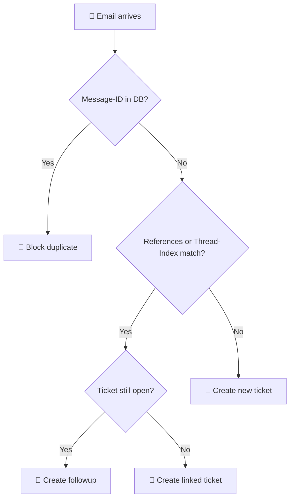

# 📧 Mail Analyzer — GLPI Plugin

<p align="center">
  
</p>

<p align="center">
  <strong>Intelligent email conversation tracking for GLPI 11</strong><br>
  Automatically combines related emails into a single ticket, preventing duplicates.
</p>

<p align="center">
  
  
  
  
</p>

---

## ✨ Features

| Feature | Description |
|---------|-------------|
| 🔁 **Duplicate Detection** | Blocks duplicate tickets when the same email is received multiple times |
| 💬 **Auto Followup** | Replies to existing tickets are automatically added as followups instead of creating new tickets |
| 🔗 **Ticket Linking** | When replying to a closed ticket, creates a new linked ticket |
| 🧵 **Thread-Index Support** | Microsoft Exchange `Thread-Index` header analysis for improved conversation tracking |
| 📊 **Statistics Dashboard** | Visual dashboard with real-time stats on processed emails, duplicates blocked, and followups created |
| 🛡️ **Domain Filtering** | Whitelist and Blacklist support to prioritize or ignore specific sender domains |
| ⚕️ **Health Check** | Real-time connection and failure monitoring for all active GLPI Mail Collectors |
| 🔔 **Smart Alerts** | Triggers native GLPI notifications when excessive duplicates are blocked |
| ⏱️ **Auto Cleanup** | Native GLPI CronTask integration for scheduled background maintenance |
| 🌍 **i18n Ready** | Fully translatable interface structured for PO/MO files (pt_BR included) |
| 🛠️ **CLI Cleanup** | Console command for purging orphaned records and old statistics |

---

## 📋 Requirements

| Requirement | Version |
|------------|---------|
| GLPI | `>= 11.0.0` and `< 11.1` |
| PHP | `>= 8.2` |
| Database | MySQL 8.0+ / MariaDB 10.5+ |

---

## 🚀 Installation

1. Download the latest release
2. Extract the `mailanalyzer` folder into your GLPI `plugins/` directory
3. Navigate to **Configuration > Plugins** in GLPI
4. Click **Install** then **Enable**

```
glpi/
└── plugins/
    └── mailanalyzer/
        ├── front/
        ├── inc/
        ├── hook.php
        ├── setup.php
        └── logo.png
```

---

## ⚙️ Configuration

Navigate to **Configuration > General > Mail Analyzer** tab.

### Options

| Option | Description |
|--------|-------------|
| **Use Thread-Index** | Enable Microsoft Exchange `Thread-Index` header support for improved conversation grouping |
| **Whitelist Domains** | Domains that should bypass certain blocks (e.g., `@trust.com`) |
| **Blacklist Domains** | Domains that are completely ignored (e.g., `@spam.com`) |

### Statistics & Health Check

The same configuration tab includes a **real-time statistics dashboard** showing:

- 🚫 **Duplicates Blocked** — Emails already received that were rejected
- 💬 **Followups Created** — Replies merged into existing tickets
- 🔗 **Tickets Linked** — New tickets linked to closed ones
- 🎫 **New Tickets** — Fresh tickets created from email

Filter stats by **7 days**, **30 days**, **90 days**, or **all time**.

---

## 🔧 How It Works



1. **Email arrives** via GLPI Mail Collector
2. **Message-ID check** — If the email was already processed, it's blocked as duplicate
3. **References/Thread-Index check** — Analyzes email headers to find related tickets
4. **Smart routing** — Adds as followup (open ticket), creates linked ticket (closed), or creates new ticket

---

## 🖥️ CLI Commands

### Cleanup orphaned records

```bash
# Purge orphaned message_id records (tickets that no longer exist)
php bin/console mailanalyzer:cleanup

# Also purge stats older than 90 days
php bin/console mailanalyzer:cleanup --stats-days=90

# Dry run — see what would be deleted without making changes
php bin/console mailanalyzer:cleanup --dry-run
```

---

## 📁 File Structure

```
mailanalyzer/
├── front/
│   ├── config.form.php         # Configuration page entry point
│   └── stats.php               # Native AJAX endpoint for dashboard filters
├── inc/
│   ├── mailanalyzer.class.php  # Core email analysis logic
│   ├── mailcollector.class.php # Extended mail collector with Thread-Index
│   ├── config.class.php        # Configuration form & stats tab
│   ├── stats.class.php         # Statistics tracking & dashboard
│   ├── crontask.class.php      # Native GLPI Cron Task for housekeeping
│   └── cleanupcommand.class.php # CLI cleanup command
├── locales/
│   └── pt_BR.po                # i18n Translation Dictionary (pt_BR)
├── hook.php                    # Install/uninstall hooks
├── setup.php                   # Plugin registration & hooks
├── logo.png                    # Plugin icon
├── mailanalyzer.xml            # Plugin metadata
└── README.md
```

---

## 📄 License

This plugin is licensed under the **GNU General Public License v2.0 or later**.

See [LICENSE](https://www.gnu.org/licenses/gpl-2.0.html) for details.

---

## 👤 Authors

- **Olivier Moron** — Original author
- **Contributors** — See [GitHub contributors](https://github.com/tomolimo/mailanalyzer/graphs/contributors)

---

<p align="center">
  <sub>Made with ❤️ for the GLPI community</sub>
</p>
